```python
from IPython.display import Image
```

use sakila;

-- 1a. Display the first and last names of all actors from the table `actor`.

select first_name, last_name from actor;


```python
Image(filename='1a.png') 
```


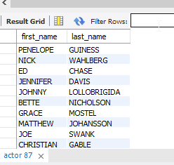


-- 1b. Display the first and last name of each actor in a single column in upper case letters. Name the column `Actor Name`. 

select upper(concat(first_name, " ", last_name)) as 'Actor Name'                                                                                                                                                                 from actor;


```python
Image(filename='1b.png')
```


-- 2a. You need to find the ID number, first name, and last name of an actor, of whom you know only the first name, "Joe." What is one query would you use to obtain this information?

select actor_id, first_name, last_name                                                                            
from actor                                                                                            
where first_name like 'Joe';


```python
Image(filename='2a.png')
```


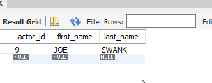


-- 2b. Find all actors whose last name contain the letters `GEN`:

select * from actor                                                                                    
where last_name like '%GEN%';


```python
Image(filename='2b.png')
```


-- 2c. Find all actors whose last names contain the letters `LI`. This time, order the rows by last name and first name, in that order:

select * from actor                                                                                        
where last_name like '%LI%'                                                                                   
order by last_name, first_name;
 


```python
Image(filename='2c.png')
```


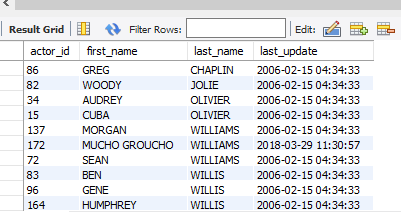


-- 2d. Using `IN`, display the `country_id` and `country` columns of the following countries: Afghanistan, Bangladesh, and China:

select country_id, country from country                                                                                   
where country in ('Afghanistan',  'Bangladesh', 'China'); 


```python
Image(filename='2d.png')
```


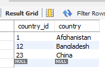


-- 3a. Add a `middle_name` column to the table `actor`. Position it between `first_name` and `last_name`. Hint: you will need to specify the data type.

desc actor;                   

alter table actor add middle_name varchar(45) after first_name;


```python
Image(filename='3a.png')
```


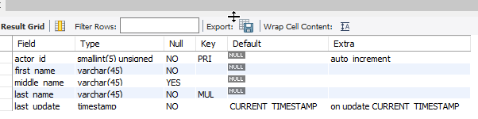


-- 3b. You realize that some of these actors have tremendously long last names. Change the data type of the `middle_name` column to `blobs`.

alter table actor change middle_name middle_name blob;

desc actor;


```python
Image(filename= '3b.png')
```


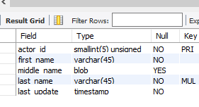


-- 3c. Now delete the `middle_name` column.

alter table actor drop middle_name;

desc actor;


```python
Image(filename='3c.png')
```


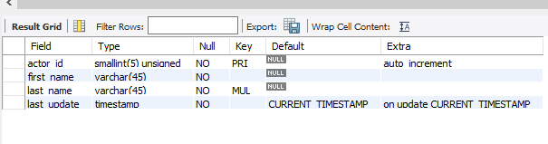


-- 4a. List the last names of actors, as well as how many actors have that last name.

select last_name, count(last_name) as 'count of same last_name' from actor                                            
group by last_name;


```python
Image(filename='4a.png')
```


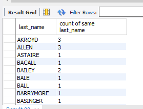


-- 4b. List last names of actors and the number of actors who have that last name, but only for names that are shared by at least two actors

select last_name, count(last_name) as 'count of same last_name' from actor                                              
group by last_name                                                                                                
having count(last_name) >= 2;


```python
Image(filename='4b.png')
```


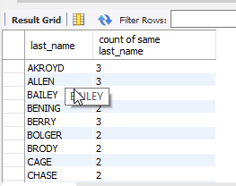


-- 4c. Oh, no! The actor `HARPO WILLIAMS` was accidentally entered in the `actor` table as `GROUCHO WILLIAMS`, the name of Harpo's second cousin's husband's yoga teacher. Write a query to fix the record.

update actor set first_name = 'HARPO'                                                                     
where first_name = 'GROUCHO'                                                                                     
  and last_name = 'WILLIAMS';                                                           

select * from actor where last_name like '%WILLIAMS%';


```python
Image(filename='4c.png')
```


-- 4d. Perhaps we were too hasty in changing `GROUCHO` to `HARPO`. It turns out that `GROUCHO` was the correct name after all! In a single query, if the first name of the actor is currently `HARPO`, change it to `GROUCHO`. Otherwise, change the first name to `MUCHO GROUCHO`, as that is exactly what the actor will be with the grievous error. 

BE CAREFUL NOT TO CHANGE THE FIRST NAME OF EVERY ACTOR TO `MUCHO GROUCHO`, HOWEVER! (Hint: update the record using a unique identifier.)

update actor set first_name = 'MUCHO GROUCHO'                                                                        
      where first_name = 'HARPO'                                                                                
      and last_name = 'WILLIAMS';


```python
Image(filename='4d.png')
```


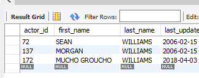


-- 5a. You cannot locate the schema of the `address` table. Which query would you use to re-create it? 
select database();

SHOW CREATE TABLE address;

show tables;


```python
Image(filename='5a.png')
```


--  6a. Use `JOIN` to display the first and last names, as well as the address, of each staff member. Use the tables `staff` and `address`:

1.) select first_name, last_name, address from staff, address                                                              
        where staff.address_id = address.address_id;

2.) select a.first_name, a.last_name, aa.address from staff a join address aa                                            
using (address_id); 


```python
Image(filename='6a.png')
```


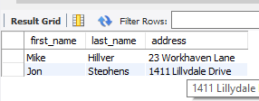


-- 6b. Use `JOIN` to display the total amount rung up by each staff member in August of 2005. Use tables `staff` and `payment`. 

select sum(p.amount) as 'Total amount' from staff a join payment p                                                     
using (staff_id)                                                                                                
where p.payment_date like '%05-08%';                                                                          


```python
Image(filename='6b.png')
```


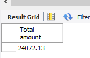


-- 6c. List each film and the number of actors who are listed for that film. Use tables `film_actor` and `film`. Use inner join.

select title, count(fa.actor_id) as 'Number of actors' from film f join film_actor fa                                    
using (film_id)                                                                                                
group by fa.film_id;                                                                        


```python
Image(filename='6c.png')
```


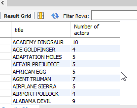


-- 6d. How many copies of the film `Hunchback Impossible` exist in the inventory system?

select title, count(i.film_id) as 'Copies' from film f join inventory i                                                   
using (film_id)                                                                                                       
where title = 'Hunchback Impossible';                                                                         


```python
Image(filename='6d.png')
```


-- 6e. Using the tables `payment` and `customer` and the `JOIN` command, list the total paid by each customer. List the customers alphabetically by last name:

select c.first_name, c.last_name, sum(p.amount) as 'Total Amount Paid' from payment p join customer c                      
using (customer_id)                                                                                                        
group by p.customer_id                                                                                                     
order by last_name;                                                                                                                                             


```python
Image(filename='6e.png')
```


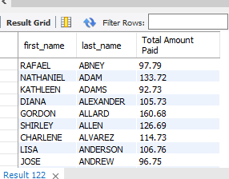


-- 7a. The music of Queen and Kris Kristofferson have seen an unlikely resurgence. As an unintended consequence, films starting with the letters `K` and `Q` have also soared in popularity. Use subqueries to display the titles of movies starting with the letters `K` and `Q` whose language is English. 

select title                                                                       
       from film                                                                                                     
       where (title like 'K%' or title like 'Q%')                                                                          
       and language_id in (select language_id from language 
                                           where name = 'English');                                                    


```python
Image(filename='7a.png')
```


-- 7b. Use subqueries to display all actors who appear in the film `Alone Trip`.

select First_name, last_name from actor                                                          
	where actor_id in ( select fa.actor_id from film f, film_actor fa where f.film_id = fa.film_id and title like 'Alone Trip');                                                        


```python
Image(filename='7b.png')
```


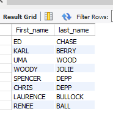


-- 7c. You want to run an email marketing campaign in Canada, for which you will need the names and email addresses of all Canadian customers. Use joins to retrieve this information.

select first_name, last_name, email                                     
from customer                                                       
where address_id in (select address_id from address where city_id in (select city_id from country c, city ca where                               c.country_id = ca.country_id and country = 'Canada'));


```python
Image(filename='7c.png')
```


-- 7d. Sales have been lagging among young families, and you wish to target all family movies for a promotion. Identify all movies categorized as famiy films.

select title from film                                                                
     where film_id in (select film_id from film_category                                                       
                 where category_id in(select category_id from category where name = 'Family'));


```python
Image(filename='7d.png')
```


-- 7e. Display the most frequently rented movies in descending order.

select title, count(r.rental_id) from inventory fi, film f, rental r                                           
where f.film_id = fi.film_id                                                                              
 and fi.inventory_id = r.inventory_id                                                                  
 group by title                                                                                   
  order by 2 desc;                                                                                     


```python
Image(filename='7e.png')
```


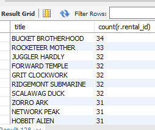


-- 7f. Write a query to display how much business, in dollars, each store brought in.  
-- still need to work on this 

1.)select i.store_id, sum(p.amount) as 'buisness_amt'                                                         
from store s, inventory i, rental r, payment p                                                     
where s.store_id = i.store_id                                                                  
 and i.inventory_id = r.inventory_id                                                               
 and r.rental_id = p.rental_id                                                                             
 group by i.store_id;                                                                             
 
 --already a view in the sakila database
 
 2.) select * from total_sales;


```python
Image(filename='7f.png')
```


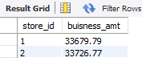


-- 7g. Write a query to display for each store its store ID, city, and country.
     
select store_id, city, country                                                                          
from store s , address a, city c, country ca                                                         
     where (s.address_id = a.address_id)                                                           
       and (a.city_id = c.city_id)                                                                        
       and (c.country_id = ca.country_id);                                                        


```python
Image(filename='7g.png')
```


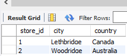


-- 7h. List the top five genres in gross revenue in descending order. 
-- (**Hint**: you may need to use the following tables: category, film_category, inventory, payment, and rental.)       
   
select c.name , count(i.film_id), sum(amount) from payment p , rental r, inventory i, film_category f, category c
	where p.rental_id = r.rental_id                                                                                   
	  and r.inventory_id = i.inventory_id                                                                             
	  and  f.category_id = c.category_id                                                                                
	   group by r.inventory_id, i.film_id,  f.category_id, c.name                                                         
	   order by 3 desc ;

-- 8a. In your new role as an executive, you would like to have an easy way of viewing the Top five genres by gross revenue. Use the 
-- solution from the problem above to create a view. If you haven't 
-- solved 7h, you can substitute another query to create a view.
 
create view top_five_genres as                                                                            
select c.name , count(i.film_id), sum(amount)                                                                 
from payment p , rental r, inventory i, film_category f, category c                                                
	where p.rental_id = r.rental_id                                                                             
	  and r.inventory_id = i.inventory_id                                                                        
	  and  f.category_id = c.category_id                                                                   
	   group by r.inventory_id, i.film_id,  f.category_id, c.name                                                  
	   order by 3 desc;


```python
Image(filename='8a.png')
```


-- 8b. How would you display the view that you created in 8a?
       
select *                                                                                      
from top_five_genres;                                                            


```python
Image(filename='8b.png')
```


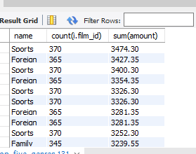


-- 8c. You find that you no longer need the view `top_five_genres`. Write a query to delete it.

drop view top_five_genres;


```python
Image(filename='8c.png')
```


